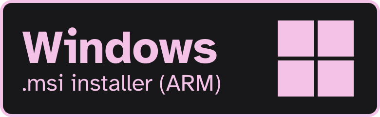

<div align="center">
  <h1>caldav-tasks</h1>

  <p>🗄️ A (work in progress) cross-platform CalDAV compatible task management app.</p>

  <!-- header badges start -->
  [![GitHub Repo stars][header-repo-stars-badge]][repo-stars]
  &nbsp;[![Total downloads][header-repo-total-downloads-badge]][repo-releases]
  &nbsp;[![Ko-fi donation link][header-donate-kofi-badge]][donate-kofi]
  &nbsp;[![Liberapay donation link][header-donate-liberapay-badge]][donate-liberapay]
  &nbsp;[![GitHub License][header-repo-license-badge]][repo-license]
  <!-- header badges end -->

  ![A screenshot of caldav-tasks, a cross-platform CalDAV compatible task management app. The sidebar shows the "RustiCal (chloe)" account with the "Albums to listen to" calendar selected. The tasks are music albums that I plan on listening to, ranging from "Revengeseekerz by Jane Remover" and "Hearth Room by Frost Children" to "girl EDM by Ninajirachi" and "10,000 gecs by 100 gecs".][header-screenshot]
</div>

## Disclaimer
> [!IMPORTANT]  
> Though the app is functional, it is currently in alpha so you might encounter bugs here and there.  
If you do, [file a bug report][header-repo-issues-link] and let me know.

# Download
You can download pre-built binaries of the application for each platform by clicking on one of the following links.

<!-- download badges start -->
[][release-windows-msi-x64]
[][release-windows-msi-arm]
[][release-macos-dmg-applesilicon]
[][release-macos-dmg-intel]
[][release-linux-deb-x86_64]
[][release-linux-deb-arm]
[][release-linux-rpm-x86_64]
[][release-linux-rpm-arm]
<!-- download badges end -->

> [!NOTE]  
> Flatpak, AppImage and AUR (Arch Linux) support is planned in a future release.

<details>
<summary>Instructions for Nix / NixOS</summary>

### Flakes
> Until the app is officially published to `nixpkgs`, you'll have to use a flake input for the time being.

Add `caldav-tasks` as an input to your `flake.nix` file.
```nix
{
  inputs = {
    # ... other inputs ...
    caldav-tasks = {
      url = "github:SapphoSys/caldav-tasks";
      inputs.nixpkgs.follows = "nixpkgs";
    };
    # ... other inputs ...
  };
}
```

### Examples
<details>
  <summary>NixOS</summary>

  ```nix
  # flake.nix
  {
    inputs = {
      nixpkgs.url = "github:NixOS/nixpkgs/nixos-unstable";
      caldav-tasks = {
        url = "github:SapphoSys/caldav-tasks";
        inputs.nixpkgs.follows = "nixpkgs";
      };
    };
    outputs = { nixpkgs, caldav-tasks, ... }: {
      nixosConfigurations.your-hostname = nixpkgs.lib.nixosSystem {
        system = "x86_64-linux";
        modules = [
          {
            environment.systemPackages = [
              caldav-tasks.packages.x86_64-linux.default
            ];
          }
          # ... etc
        ];
      };
    };
  }
  ```
</details>

<details>
  <summary>Home Manager</summary>

  ```nix
  { pkgs, inputs, ... }:
  {
    home.packages = [
      inputs.caldav-tasks.packages.${pkgs.system}.default
    ];
  }
  ```
</details>

<details>
  <summary>macOS (nix-darwin)</summary>
  
  ```nix
  # flake.nix
  {
    inputs = {
      nixpkgs.url = "github:NixOS/nixpkgs/nixos-unstable";
      darwin = {
        url = "github:LnL7/nix-darwin";
        inputs.nixpkgs.follows = "nixpkgs";
      };
      caldav-tasks = {
        url = "github:SapphoSys/caldav-tasks";
        inputs.nixpkgs.follows = "nixpkgs";
      };
    };
    outputs = { nixpkgs, darwin, caldav-tasks, ... }: {
      darwinConfigurations.your-macbook = darwin.lib.darwinSystem {
        system = "aarch64-darwin";  # or "x86_64-darwin"
        modules = [
          {
            environment.systemPackages = [
              caldav-tasks.packages.aarch64-darwin.default
            ];
          }
        ];
      };
    };
  }
  ```
</details>
</details>

# Support
If you found caldav-tasks useful, please consider donating! 

I work on caldav-tasks during my free time as a student, so every amount, however small, helps with rent and food costs. Thank you :)

<!-- donation badges start -->
[][donate-kofi]
[][donate-liberapay]
<!-- donation badges end -->

# Compatibility
Does the app work on other CalDAV servers or CalDAV-compatible clients that are not listed here? [Please let me know by filing an issue](https://github.com/SapphoSys/caldav-tasks/issues/new)!

## Servers
| Server              | Support |
| ------------------- | ------- |
| Nextcloud Tasks     | ✅      |
| Baikal              | ✅      |
| Radicale            | ✅      |
| RustiCal            | ✅      |
| Fastmail            | ✅      |

## Clients
| Client              | Support |
| ------------------- | ------- |
| DAVx⁵               | ✅      |
| Apple Reminders     | ✅      |
| Tasks.org           | ✅      |
| jtx Board           | ✅      |

# License
caldav-tasks is licensed under the [<span aria-hidden="true">&nearr;</span> zlib/libpng][repo-license] license.

[donate-kofi]: https://ko-fi.com/solelychloe
[donate-liberapay]: https://liberapay.com/chloe

[header-donate-kofi-badge]: https://img.shields.io/badge/donate-kofi-f5c2e7?style=plastic&logo=kofi&logoColor=f5c2e7&labelColor=18181b&cacheSeconds=1000
[header-donate-liberapay-badge]: https://img.shields.io/badge/donate-liberapay-f5c2e7?style=plastic&logo=liberapay&logoColor=f5c2e7&labelColor=18181b&cacheSeconds=1000
[header-repo-license-badge]: https://img.shields.io/github/license/SapphoSys/caldav-tasks?style=plastic&labelColor=18181b&color=f5c2e7&cacheSeconds=1000
[header-repo-stars-badge]: https://img.shields.io/github/stars/SapphoSys/caldav-tasks?style=plastic&logo=github&logoColor=f5c2e7&labelColor=18181b&color=f5c2e7&cacheSeconds=1000
[header-repo-total-downloads-badge]: https://img.shields.io/github/downloads/SapphoSys/caldav-tasks/total?style=plastic&logo=hack-the-box&logoColor=f5c2e7&label=downloads&labelColor=18181b&color=f5c2e7&cacheSeconds=1000

[header-repo-issues-link]: https://github.com/SapphoSys/caldav-tasks/issues
[header-screenshot]: ./.github/assets/screenshot.png

[release-windows-msi-x64]: https://github.com/SapphoSys/caldav-tasks/releases/download/app-v0.7.0/caldav-tasks_0.7.0_x64_en-US.msi
[release-windows-msi-arm]: https://github.com/SapphoSys/caldav-tasks/releases/download/app-v0.7.0/caldav-tasks_0.7.0_arm64-en_US.msi
[release-macos-dmg-applesilicon]: https://github.com/SapphoSys/caldav-tasks/releases/download/app-v0.7.0/caldav-tasks_0.7.0_aarch64.dmg
[release-macos-dmg-intel]: https://github.com/SapphoSys/caldav-tasks/releases/download/app-v0.7.0/caldav-tasks_0.7.0_x64.dmg
[release-linux-deb-x86_64]: https://github.com/SapphoSys/caldav-tasks/releases/download/app-v0.7.0/caldav-tasks_0.7.0_amd64.deb
[release-linux-deb-arm]: https://github.com/SapphoSys/caldav-tasks/releases/download/app-v0.7.0/caldav-tasks_0.7.0_arm64.deb
[release-linux-rpm-x86_64]: https://github.com/SapphoSys/caldav-tasks/releases/download/app-v0.7.0/caldav-tasks-0.7.0-1.x86_64.rpm
[release-linux-rpm-arm]: https://github.com/SapphoSys/caldav-tasks/releases/download/app-v0.7.0/caldav-tasks-0.7.0-1.aarch64.rpm

[repo-license]: https://github.com/SapphoSys/caldav-tasks/blob/master/LICENSE
[repo-releases]: https://github.com/SapphoSys/caldav-tasks/releases
[repo-stars]: https://github.com/SapphoSys/caldav-tasks/stargazers
